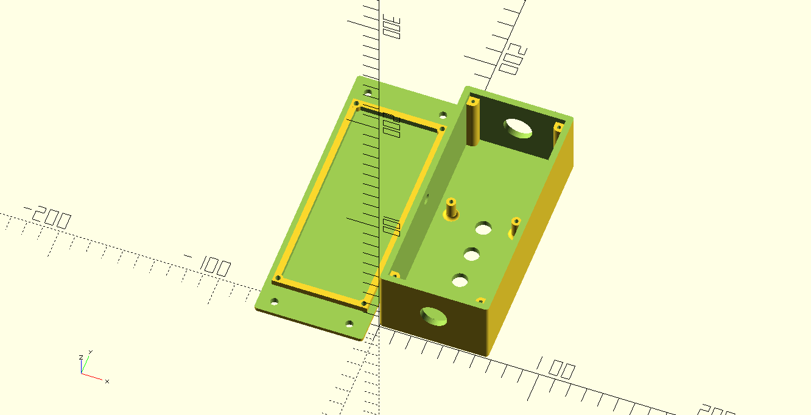
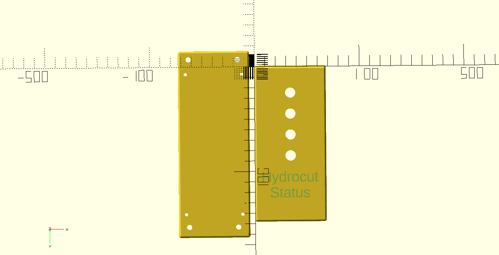
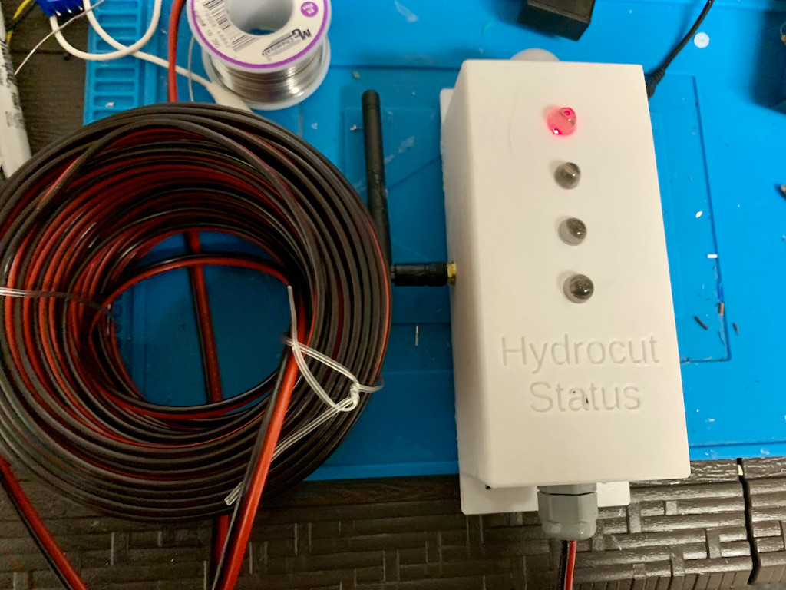

# SCAD Enclosures

This repo is a set of enclosures downloaded from Thingaverse and elsewhere and modified for my own use. The models can be used with SCAD to generate STL files for 3D printing.

## Best Models

The best models to use are the enclosure_snap and project_box_screws_r3. enclosure_snap has a snap on lid and is useful for small projects used indoors. project_box_screws_r3 is simular to enclosure snap, but has a screw on lid for a bit more secure project box.

## Project Box R3

This is a project box for the Trail Status Indicator for the Trail Monitoring System, but it can be used anywhere. The original design was taken from Thingaverse. This is a good example how to make a customized project box for a embedded device. The filleted screw holes allow the device to be screwed into the box.

The LED holes, bottom and top holes can be disabled in the project_box_screws_r3.scad file. The text on the top of the box is currently hard coded, but can be commented out.

